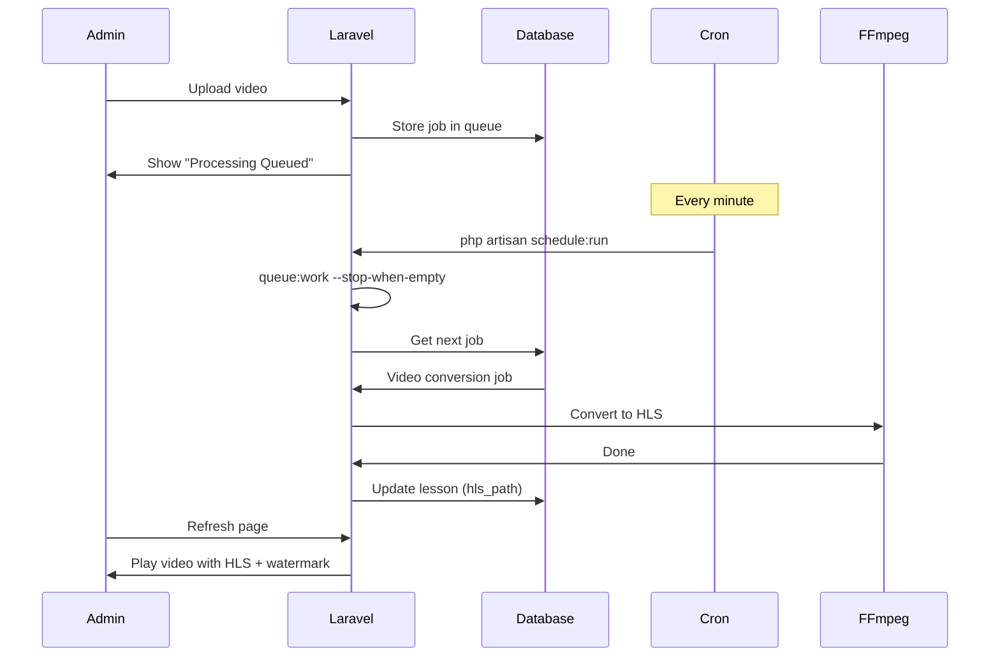

# Setting Up Automatic Video Processing with Cron Jobs

This guide shows you how to set up automatic video processing on SiteGround using cron jobs.

## What This Does

- **Automatically processes video conversions** every minute
- **Converts uploaded videos to HLS format** with encryption
- **No manual intervention needed** - just upload and wait
- **Works on shared hosting** (SiteGround compatible)

## Step-by-Step Setup

### Step 1: Access SiteGround Site Tools

1. Log in to your SiteGround account
2. Go to **Site Tools** for your domain
3. Navigate to **Devs** → **Cron Jobs**

### Step 2: Create the Cron Job

Click **"Create Cron Job"** and configure:

#### Cron Job Settings:

**Frequency:**
- **Type:** Common
- **Interval:** Every minute (or use custom: `* * * * *`)

**Command:**
```bash
cd ~/www/ahmeds172.sg-host.com/public_html && php artisan schedule:run >> /dev/null 2>&1
```

**Important:** Replace `ahmeds172.sg-host.com` with your actual domain/subdomain folder name.

#### Breaking Down the Command:

- `cd ~/www/ahmeds172.sg-host.com/public_html` - Navigate to your Laravel installation
- `php artisan schedule:run` - Run Laravel's task scheduler
- `>> /dev/null 2>&1` - Suppress output to avoid email spam

### Step 3: Save the Cron Job

Click **"Create"** to save the cron job.

### Step 4: Verify It's Working

#### Test the Schedule Manually (SSH):

```bash
ssh -p 18765 u2716-quvmxuw4umbi@ssh.ahmeds172.sg-host.com
cd ~/www/ahmeds172.sg-host.com/public_html
php artisan schedule:run
```

You should see:
```
Running scheduled command: php artisan queue:work --stop-when-empty --max-time=50
```

#### Check Queue is Processing:

1. Upload a video as admin
2. The video will show "Video Processing Queued"
3. Wait 1-2 minutes (cron runs every minute)
4. Refresh the lesson page
5. Video should be processing or ready

## How It Works



## Configuration Details

The scheduler is configured in `routes/console.php`:

```php
// Process video conversion queue every minute
Schedule::command('queue:work --stop-when-empty --max-time=50')
    ->everyMinute()
    ->withoutOverlapping()
    ->runInBackground();
```

### Parameters Explained:

- `--stop-when-empty` - Exits when no more jobs (doesn't run forever)
- `--max-time=50` - Stops after 50 seconds (within 1-minute cron interval)
- `withoutOverlapping()` - Prevents multiple instances from running
- `runInBackground()` - Doesn't block other scheduled tasks

## Monitoring

### Check if Cron is Running:

In Site Tools → **Devs** → **Cron Jobs**, you'll see:
- ✅ Green checkmark if successful
- ❌ Red X if failed
- Last run time

### Check Queue Status (SSH):

```bash
# View pending jobs
php artisan queue:monitor

# View failed jobs
php artisan queue:failed

# Retry failed jobs
php artisan queue:retry all
```

### Check Laravel Logs:

```bash
tail -f storage/logs/laravel.log
```

Look for:
```
Starting HLS conversion for lesson 1
HLS conversion completed for lesson 1
```

## Troubleshooting

### Cron Not Running

**Check cron syntax:**
```bash
* * * * * cd ~/www/ahmeds172.sg-host.com/public_html && php artisan schedule:run >> /dev/null 2>&1
```

Make sure:
- Path is correct (`~/www/YOUR_FOLDER/public_html`)
- No extra spaces
- Frequency is set to "Every minute"

### Videos Not Processing

1. **Check queue table has jobs:**
```bash
php artisan tinker
DB::table('jobs')->count();
```

2. **Check if jobs are failing:**
```bash
php artisan queue:failed
```

3. **Check FFmpeg is available:**
```bash
which ffmpeg
ffmpeg -version
```

4. **Check storage permissions:**
```bash
ls -la storage/app/hls/
chmod -R 775 storage/app/hls/
```

### Jobs Failing

**View error details:**
```bash
php artisan queue:failed
```

**Retry specific failed job:**
```bash
php artisan queue:retry [job-id]
```

**Clear failed jobs:**
```bash
php artisan queue:flush
```

## Alternative: Process Videos Immediately (Synchronous)

If cron jobs don't work, you can process videos immediately during upload:

1. Edit `.env` on SiteGround:
```bash
QUEUE_CONNECTION=sync
```

2. Clear config cache:
```bash
php artisan config:cache
```

**Note:** This makes uploads slower but videos process immediately.

## Performance Tips

### For Large Videos:

Increase PHP limits in Site Tools → **Devs** → **PHP Manager**:
- `max_execution_time`: 300 (5 minutes)
- `memory_limit`: 512M or higher

### For Multiple Videos:

The queue processes one video at a time. If you upload multiple videos:
- First video: Processes in ~1-2 minutes
- Second video: Starts after first completes
- And so on...

## Success Indicators

✅ **Everything is working when:**

1. Upload a video
2. Page shows "Video Processing Queued"
3. After 1-2 minutes, page shows "Processing video..."
4. After conversion completes (depends on size), video plays with:
   - HLS encrypted streaming
   - User watermark overlay
   - Moving watermark position

## Support

If videos still don't process after 5 minutes:

1. Check cron job is enabled in Site Tools
2. Check Laravel logs: `storage/logs/laravel.log`
3. Test manually: `php artisan queue:work --stop-when-empty`
4. Verify FFmpeg works: `ffmpeg -version`

## Summary

**You've successfully set up:**
- ✅ Automatic video processing via cron
- ✅ HLS encryption with AES-128
- ✅ Dynamic watermarks with user info
- ✅ Download protection from browser extensions
- ✅ Scheduled tasks running every minute

**Next:** Just upload videos and they'll automatically convert!

